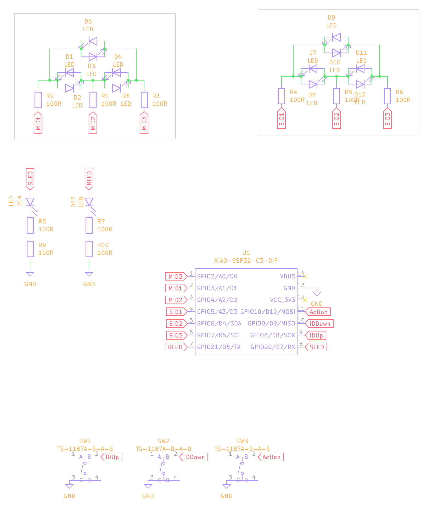

# Small Morse Code Handheld Devices

From: @Pegoku

ESP32-C3 based boards that connect to each other and let you send and receive messages using ESPNOW.

## BOM (Per PCB)

| Item           | Quantity | JLCPCB PN. |
| -------------- | -------- | ---------- |
| XIAO ESP32-C3  | 1        | N/A        |
| 100 Ω resistor | 10       | C22775     |
| Push button    | 3        | C318884    |
| 0805 Red LED   | 14       | C84256     |
